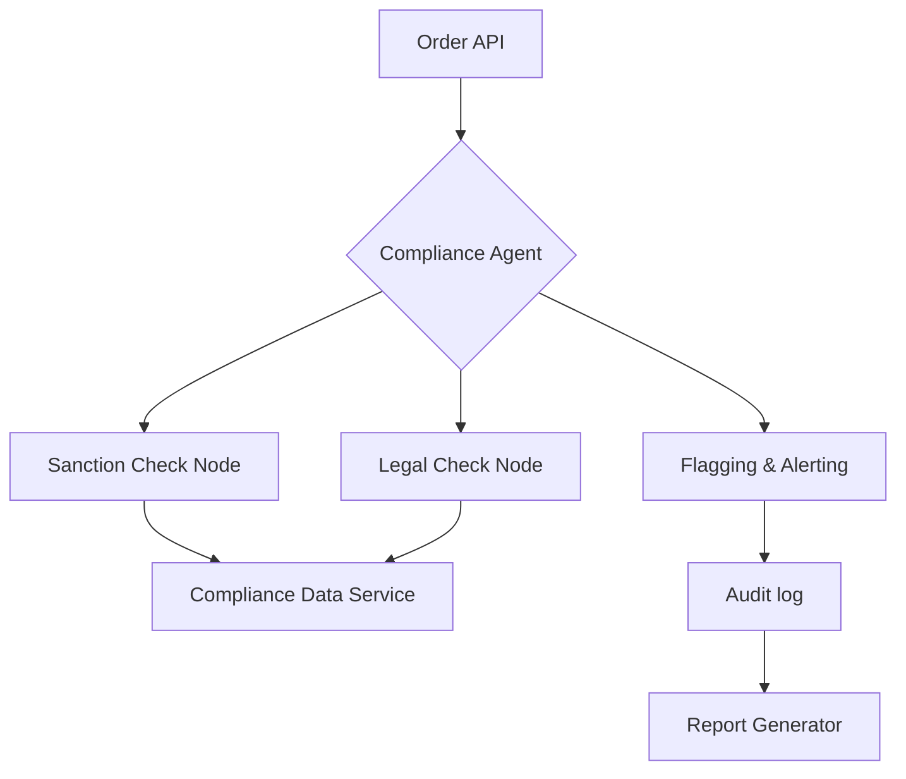

# AI-Driven Compliance Screening System

## Challenge Overview
This project is an **Agentic AI application** developed for the Wipro AI Driven Compliance Screening System Challenge. The system leverages an agentic framework to perform real-time compliance screening of orders, ensuring regulatory and legal adherence.

## Key Features
- **Real-time Order Screening:** Instant processing of incoming orders via a high-performance FastAPI backend.
- **Agentic Workflow (LangGraph):** Orchestrates complex compliance logic across multiple specialized nodes (Sanction Check, Legal & Regulatory Check).
- **Trusted Data Integration:** Uses integrated compliance data sources to validate recipients and shipping destinations.
- **Instant Violation Flagging:** Automatically flags high-risk transactions for immediate review or rejection.
- **Audit-Ready Reports:** Generates comprehensive PDF audit reports for every screening event using WeasyPrint.

## Tech Stack
- **Backend:** FastAPI (Python 3.11)
- **Agentic Framework:** LangGraph / LangChain
- **LLM:** Google Gemini 2.0 Flash
- **Database/Caching:** PostgreSQL & Redis
- **Reporting:** WeasyPrint (HTML-to-PDF)
- **Deployment:** Docker & Docker Compose

## System Architecture
The application uses a directed graph to route orders through compliance checkpoints:



## Getting Started

### Prerequisites
- Docker and Docker Compose installed on your system.
- Google API Key (For dynamic AI-driven compliance reasoning).

### Installation & Running
1. **Clone the repository:**
   ```bash
   git clone <repository_url>
   cd "Wipro AI Driven Compliance Screening System Challenge"
   ```

2. **Set Environment Variables:**
   Create a `.env` file in the root or set them in your environment:
   ```env
   GOOGLE_API_KEY=your_api_key_here
   ```

3. **Launch the System:**
   ```bash
   docker-compose up --build -d
   ```
   *Note: To avoid conflicts, the services are mapped as follows:*
   - **Backend API:** `http://localhost:8080`
   - **Database:** `localhost:5433`
   - **Redis:** `localhost:6380`

## API Documentation
FastAPI provides interactive API documentation out of the box. Once the system is running, you can access:
- **Swagger UI:** [http://localhost:8080/docs](http://localhost:8080/docs)
- **ReDoc:** [http://localhost:8080/redoc](http://localhost:8080/redoc)

These interfaces allow you to explore all endpoints, view detailed request/response schemas, and even execute screenings directly from your browser.

## Usage Examples

### 1. Screen a Safe Order
```bash
curl -X POST http://localhost:8080/screen-order \
  -H "Content-Type: application/json" \
  -d '{
    "order_id": "ORD-001",
    "customer_id": "CUST-123",
    "items": [{"name": "Laptop", "category": "Electronics", "quantity": 1, "price": 1200.0}],
    "shipment": {"recipient_name": "John Doe", "recipient_address": "123 Main St", "recipient_country": "USA"}
  }'
```

### 2. Screen a Sanctioned Order
```bash
curl -X POST http://localhost:8080/screen-order \
  -H "Content-Type: application/json" \
  -d '{
    "order_id": "ORD-002",
    "customer_id": "CUST-456",
    "items": [{"name": "Server", "category": "IT Infrastructure", "quantity": 1, "price": 5000.0}],
    "shipment": {"recipient_name": "Alpha Corp (Sanctioned)", "recipient_address": "789 Secret St", "recipient_country": "Sanctionia"}
  }'
```

## Validation & Testing
You can run the automated validation script directly inside the container:
```bash
docker-compose exec backend python tests/test_screening.py
```
Generated PDF reports can be found in `backend/tests/reports/` after running screenings.

## Standards Followed
- **Clean Code:** Modular Python services and Pydantic schemas.
- **Robustness:** Async API handling and error-resilient agentic flows.
- **Auditability:** Every check is timestamped and logged in final reports.
